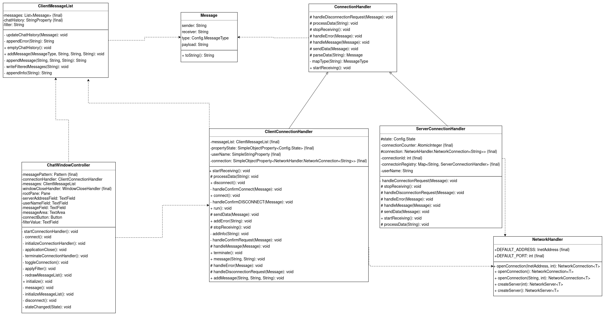

# Multichat improved by muellti3 & kisphi01

## Introduction
The Multichat application implements a chat service in which multiple users can exchange simple text messages.
## Getting started

### Requirements
a running java installation

### How to run
1. Clone the repository
2. Open the project in your IDE or Console
3. run `gradle build`
4. run `gradle run` on server
5. run `gradle run` on client
6. Connect with as many clients as you like

## Internal Coding Agreements

### Branching Model
There are two write protected branches which can only be accessed by way of a pull request. The main branch is thought 
of as the productive branch and the dev branch is used to synchronise the development efforts of the individual 
contributors. To implement a new feature, we require that a new feature branch is created. To get a pull request 
accepted into the dev branch, the feature needs to be clean and documented.

### Language (Documentation and Code)
- English

### Issues:
- Create GitHub issues for every functional error and structural problem
- Always use GitHub Issue Templates
- Differentiate between functional errors (functionality not working as expected) and structural problems
(poor structure, violated patterns, clean code issues, etc.) by using labels.
- Add issues to the associated pull request

### Usage of AI

Ai was used for following tasks:
- JavaDoc generation
- finding possible helpful methods in public java classes

## Documentation of bugs

### Most relevant structural problems
1. [Store message data in separate object](https://github.zhaw.ch/PM2-IT22aWIN-fame-mach-dihl/uebung-hk1-kisphi01-muellti3/issues/3)
2. [Prevent duplicate code in ServerConnectionHandler and ClientConnectionHandler](https://github.zhaw.ch/PM2-IT22aWIN-fame-mach-dihl/uebung-hk1-kisphi01-muellti3/issues/4)
3. [MVC with ClientWindowController and ClientConnectionHandler](https://github.zhaw.ch/PM2-IT22aWIN-fame-mach-dihl/uebung-hk1-kisphi01-muellti3/issues/5)
4. [Split the method processDate()](https://github.zhaw.ch/PM2-IT22aWIN-fame-mach-dihl/uebung-hk1-kisphi01-muellti3/issues/8)
5. [Move static datafields from ServerConnectionHandler and ClientConnectionHandler to Config](https://github.zhaw.ch/PM2-IT22aWIN-fame-mach-dihl/uebung-hk1-kisphi01-muellti3/issues/17)

### Most relevant functional errors
1. [Client connection queue](https://github.zhaw.ch/PM2-IT22aWIN-fame-mach-dihl/uebung-hk1-kisphi01-muellti3/issues/21)
2. [Delete text in compose field after sending the message](https://github.zhaw.ch/PM2-IT22aWIN-fame-mach-dihl/uebung-hk1-kisphi01-muellti3/issues/20)
3. [Direct Messages only get shown to the recipient](https://github.zhaw.ch/PM2-IT22aWIN-fame-mach-dihl/uebung-hk1-kisphi01-muellti3/issues/27)
4. [Disconnect all users when server is shutdown](https://github.zhaw.ch/PM2-IT22aWIN-fame-mach-dihl/uebung-hk1-kisphi01-muellti3/issues/28)
5. [Able to change connection details while still connected](https://github.zhaw.ch/PM2-IT22aWIN-fame-mach-dihl/uebung-hk1-kisphi01-muellti3/issues/31)

## Our solution

### Class diagram

### Description of the solution

#### Model-View-Controller
The MVC (Model-View-Controller) was implemented as follows. The View is the ChatWindow.fxml and the Controller is the 
ChatWindowController. The two main models are the "ClientConnectionHandler" in the "ClientMessageList".

The View listens to the Controller, and the Controller knows the View and calls its methods. The Controller manages 
the two models. The models themselves can and should not access the Controller directly. The Controller listens to the 
models using the Observer pattern. In particular, the Controller listens to the Chat history in the ClientMessageList 
and to the Username, NetworkHandler, and ConnectionStatus in the ClientController. The Status, in particular, helps to 
lock GUI components that the user cannot use in this state. The ClientConnectionHandler accesses the ClientMessageList, 
but this does not violate the MVC principle.

The good thing about the MVC principle is that the MVC components are well separated and more maintainable. The code is 
also easily extensible, as one can simply add new listeners or models without having to modify the Controller. 
Additionally, one can easily add a new Controller and View if desired.

#### Protocol
The package Protocol contains all interfaces between the Client and Server. In other words, all classes that concern 
both packages are included in it. The goal is to later have both the Client and Protocol packages stored locally at the 
client and the Server and Protocol packages stored at the server. This way, both parties can access them. The good 
thing about this system is that it is very future-proof. Whenever a class arises that both parties need, it can simply 
be added to the Protocol.

#### Superclass ConnectionHandler
The superclass ConnectionHandler, from which both the ClientConnectionHandler and ServerConnectionHandler classes 
inherit, is located in the Protocol package. This reduces code duplication between the two subclasses. This improves 
at least two things. Firstly, the code becomes easier to read, and secondly, it is easier to maintain. This brings us 
to how we can develop the Multichat more easily in the future thanks to inheritance. From now on, if we want to add a 
method that both subclasses can use, we can simply implement it in the superclass, and both can use it. It also keeps 
open the possibility of easily implementing an additional subclass if needed.

#### Config.file
The Config.file is also located in the Protocol package. It contains all enums and static final strings that are 
accessible to all classes. This reduces code duplication, and everyone knows where to find these strings and enums. 
In the future, if a new static type is added, this Config.file can be easily updated.
## Contributors
[Philipp Kiss](https://github.zhaw.ch/kisphi01) \
[Tim Müller](https://github.zhaw.ch/muellti3)

